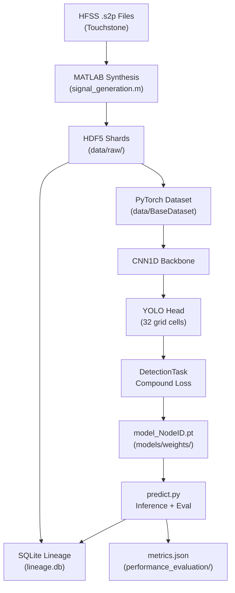

# MLOps-Driven Partial Discharge (PD) Detection Pipeline

> **KIE4002 Final Year Project** — An end-to-end, production-grade Machine Learning pipeline designed to synthesize, ingest, isolate, classify, and localize Partial Discharge (PD) signals in complex industrial environments using a 4-sensor UHF array.

---

## 📖 Project Overview

This Final Year Project bridges the gap between academic theory and industrial application by solving the **Overlap Problem** — the challenge of detecting multiple, simultaneous PD events masked by heavy structured noise.

The system operates on two parallel tracks:

| Track | Description |
|-------|-------------|
| 🔬 **Synthetic** | Mathematically rigorous data driven by HFSS co-simulation |
| 📡 **Real-World** | Augmented measurements captured from physical UHF sensors |

To manage the immense complexity of multi-stage processing, the pipeline employs a strict **Data Lineage Tracking System** (SQLite) and a highly modular, **Task-Driven PyTorch Architecture**.

---

## ✨ Key Features

- **Physics-Based Synthesis** — A MATLAB engine utilises HFSS `.s2p` Touchstone files to mathematically distort simulated Gaussian pulses based on calculated Time Difference of Arrival (TDOA) and 3D spatial geometry.

- **Autonomous Ground Truth Labeling** — Dynamically generates 7-column physics-tracking labels:
  ```
  [Scene_ID, Channel_ID, Class_ID, Pulse_Instance_ID, TOA_Index, Start_Idx, End_Idx]
  ```

- **Directed Acyclic Graph (DAG) Tracking** — A centralised SQLite database tracks the exact ancestry of every dataset and neural network weight, preventing data loss and enabling safe experiment pruning. Naming convention: `YYYYMMDD_HHMMSS_[Origin]-[RootID]-[NodeID]`

- **Task-Driven PyTorch Factory** — Decouples `Dataset`, `Backbone`, `Head`, and `Task Objective` into Lego-style blocks that allow infinite modularity without monolithic training loops.

- **Cloud-Ready HDF5 Sharding** — Handles massive continuous time-series tensors safely by sharding data and utilising dynamic PyTorch decimation (downsampling) to prevent GPU OOM errors (e.g., 500,001 → 1,000 points via `decimation_factor=500`).

- **Compound YOLO Loss** — Joint detection + classification loss:
  ```
  L = λ_obj · BCE_obj  +  λ_box · SmoothL1_box  +  λ_cls · CE_cls
  ```
  With `pos_weight` upweighting to counteract ~85% background grid cells.

---

## 🗂️ Directory Architecture (Master Blueprint v3.0)

> **Note:** `data/` and `models/` (weights) are strictly `.gitignore`'d. Only source code is version-controlled.

```
PD_FYP_Pipeline/
├── data/
│   ├── touchstone_files/             # HFSS .s2p Touchstone files
│   ├── unprocessed_measured/         # Raw oscilloscope .wfm files
│   ├── raw/                          # Birthplace of 'sy' and 'ms' HDF5 shards
│   ├── isolation_output/             # Bounding boxes (.h5)
│   ├── features/                     # Extracted features (e.g., CWT matrices)
│   ├── classification_output/        # Predicted classes & boxes (Downstream routing)
│   ├── tdoa/                         # Calculated time delays
│   ├── localisation_output/          # 3D spatial coordinates
│   ├── performance_evaluation/       # Metrics, plots, confusion matrices
│   └── lineage.db                    # SQLite Master Tracking Database
│
├── models/
│   ├── weights/                      # .pt checkpoint files (Named by NodeID)
│   └── configuration_snapshots/      # config.yaml snapshots (Named by NodeID)
│
└── src/                              # All source code (version-controlled)
    ├── generation/                   # MATLAB HFSS synthesis scripts
    ├── ingestion/                    # .wfm → .h5 conversion scripts
    ├── isolation/                    # Traditional (non-DL) signal isolation
    ├── classification/               # Traditional ML algorithms (e.g., DBSCAN)
    ├── obtain_tdoa/                  # Cross-Correlation TDOA math
    ├── localisation/                 # Particle Swarm Optimization (PSO)
    ├── utils/                        # Python CLIs (lineage_tracker.py)
    └── models/                       # ⚡ DEEP LEARNING HUB
        ├── configs/                  # Experiment YAML configs
        ├── data/                     # PyTorch Datasets & DataLoaders
        ├── models/
        │   ├── backbones/            # 1D CNN feature extractors
        │   └── heads/                # YOLO detection heads
        ├── tasks/                    # Task logic (Detection, Classification)
        ├── train.py                  # Universal DAG orchestrator
        └── predict.py                # Inference + performance evaluation
```

---

## 🚀 Getting Started

### Prerequisites

```bash
pip install -r requirements.txt
```

| Dependency | Version |
|------------|---------|
| `torch` | ≥ 2.1.0 |
| `numpy` | ≥ 1.26.0 |
| `h5py` | ≥ 3.10.0 |
| `PyYAML` | ≥ 6.0.0 |

MATLAB (with the MATLAB Engine for Python) is additionally required for the synthetic data generation stage.

---

### Step 1 — Initialize the Master Ledger

Before generating any data, initialise the SQLite tracking database:

```bash
python src/utils/lineage_tracker.py --action init
```

---

### Step 2 — Generate Synthetic Data (MATLAB)

Navigate to `src/generation/` and execute the Master Orchestrator in MATLAB.

**Script:** `signal_generation.m`

This script will:
1. Read HFSS `.s2p` Touchstone files to model the physical UHF channel.
2. Synthesise Gaussian PD pulses, distorted by physics-calculated TDOA and 3D geometry.
3. Generate HDF5 shards and autonomously assign unique Pulse IDs.
4. Execute a Python system call to register the Root Dataset into the SQLite ledger.

---

### Step 3 — Train the Deep Learning Pipeline

Define your hyperparameters, dataset targets, and model architecture in a YAML config file inside `src/models/configs/`. Then run the universal orchestrator:

```bash
python src/models/train.py --config configs/exp01_yolo1d.yaml
```

**Example config** (`exp01_yolo1d.yaml`) trains a `1D CNN Backbone + Anchor-Free YOLO Head` for joint PD isolation and classification on the `ShmH` synthetic dataset.

---

### Step 4 — Run Inference & Evaluation

After training, run the inference script to generate predictions and compute performance metrics automatically:

```bash
python src/models/predict.py --config configs/exp01_yolo1d.yaml --node_id <NodeID>
```

Outputs saved to `data/performance_evaluation/` include:
- `metrics.json` — Precision, Recall, F1, mIoU, Class Accuracy
- Confusion matrices and prediction plots
- Lineage registration of the evaluation run

---

## 🧠 Model Architecture

The pipeline uses a **Task-Driven Factory** pattern. All components are decoupled:

```
Signal Input (B, 1, 1000)
        │
        ▼
┌───────────────┐
│ CNN1DBackbone │  — Extracts hierarchical features; doubles channels per block
│  (base_ch=32) │    Output: (B, 256, 32)
└───────┬───────┘
        │
        ▼
┌───────────────┐
│   YOLO Head   │  — Anchor-free; predicts 5 values per grid cell
│  (32 cells)   │    Output: (B, 32, 5)
└───────┬───────┘
        │
        ▼
Per-cell predictions:
  [objectness_logit, centre_offset_logit, log_width, class_logit_0, class_logit_1]
```

### Coordinate Decoding

Raw logits are decoded back to raw sample indices:

```
centre_norm(i) = (i + sigmoid(pred_centre)) / S
width_norm     = exp(pred_logwidth)
start_norm     = centre_norm - width_norm / 2
end_norm       = centre_norm + width_norm / 2

# Scale back to raw samples:
start_raw = int(start_norm * seq_len) * decimation_factor
end_raw   = int(end_norm   * seq_len) * decimation_factor
```

---

## 🔍 Lineage Tracking (CLI)

The DAG tracking system uses a cryptographic-style naming convention:

```
YYYYMMDD_HHMMSS_[Origin]-[RootID]-[NodeID]
```

Where `Origin` is `sy` (synthetic) or `ms` (measured).

### Available Commands

**Initialize the database:**
```bash
python src/utils/lineage_tracker.py --action init
```

**Visualize an experiment tree:**
```bash
python src/utils/lineage_tracker.py --action visualize --root_id Xa3A
```

**Safely prune/delete a dead-end experiment:**
```bash
python src/utils/lineage_tracker.py --action prune --node_id 8Hh7
```

All HDF5 files contain a verbose `analysis_history` attribute detailing their exact algorithmic ancestry.

---

## 📐 Architectural Rules & Constraints

| Rule | Description |
|------|-------------|
| **Downstream Routing Rule** | Models performing multiple sequential tasks (e.g., Isolation → Classification) save ALL artifacts to the **most downstream** task's folder. No output scattering. |
| **Metadata Injection** | Every HDF5 file carries a verbose `analysis_history` attribute detailing its exact algorithmic ancestry. |
| **No Monolithic Models** | PyTorch architectures must be built as decoupled Lego blocks: `Dataset + Backbone + Head + Task`. No monolithic training loops. |
| **DAG-Only Deletions** | All experiment artifacts must be pruned via the lineage tracker CLI, never deleted manually. |
| **Data Gitignore** | `data/` and `models/weights/` are strictly `.gitignore`'d. Only source code is version-controlled. |

---

## 🗺️ Full Pipeline Flow



---

## 📄 License

This project is submitted in partial fulfilment of the requirements for the Bachelor of Engineering degree at the Faculty of Engineering, Universiti Malaya. All rights reserved.
